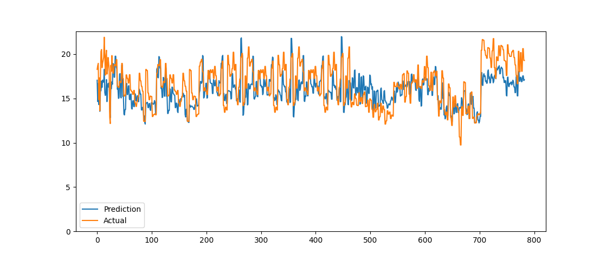
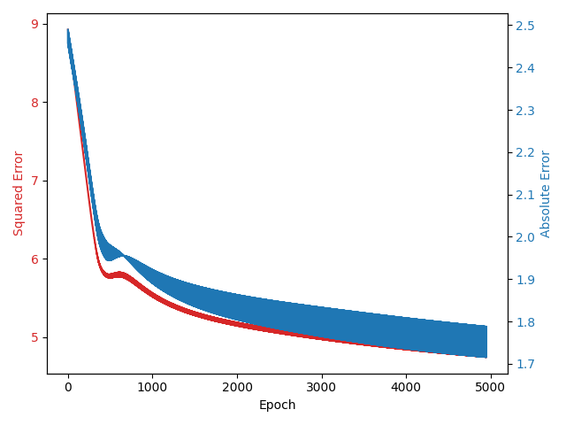

# Mango-DMC-MLP (Mango Dry Matter Content Multilayer Perceptron)
A neural network model that predicts the dry matter content of mangoes based off of near-infrared spectroscopy absorbance data. The model only uses NumPy to calculate the neural network as it was designed to be a learning exercise to understand the mathematical fundamentals behind neural networks, not necessarily to create the most optimal model.

## Data
This model uses data from the [mango-dmc](https://data.mendeley.com/datasets/46htwnp833/1) dataset, provided by Anderson et al. 2020.

From `NAnderson2020MendeleyMangoNIRData.csv`, we used the dry matter (`DM`) column for $y$ and only the NIR data (columns `285`-`1200`) for $X$. During preprocessing we filtered out any NIR columns that only contained `0` values, and any sparse rows that contained more than 10 `0` values.

## Installation
Create a virtual environment.
```
python -m venv venv
```
Activate virtual environment.
```
venv\Scripts\activate
```
Install requirements for `requirements.txt`
```
pip install -r requirements.txt
```
## Usage
```
py main.py "NAnderson2020MendeleyMangoNIRData.csv"
```

## Results
We used the following hyperparameters:
```
learning_rate = 0.000001
epochs = 5000
regularisation_lambda = 0.00000001
clip_threshold = 0.001
regularisation = 2
hidden_activation = "relu"
seed = 2
L = 4
U = [200, 50, 10, 1]                       
```
They obtained the following mean squared error and mean absolute error:
```
MSE: 3.56412622769269
MAE: 1.51735262370372
```
The model demonstrates some ability to fit the data:

The training error over time:
